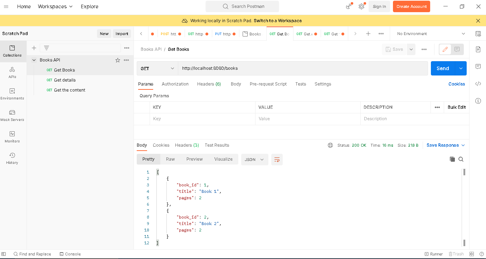
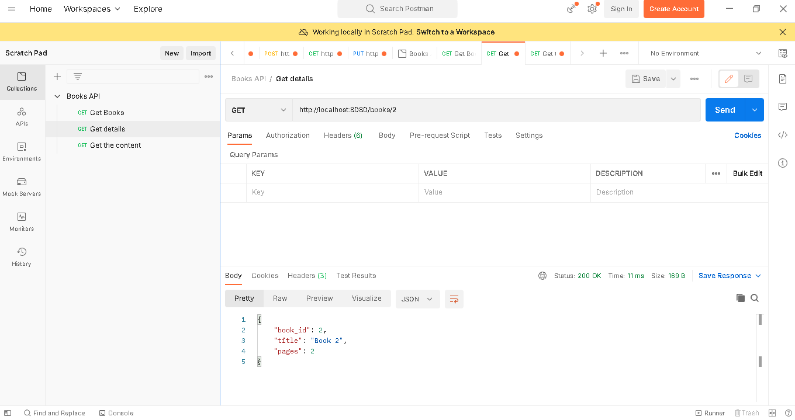
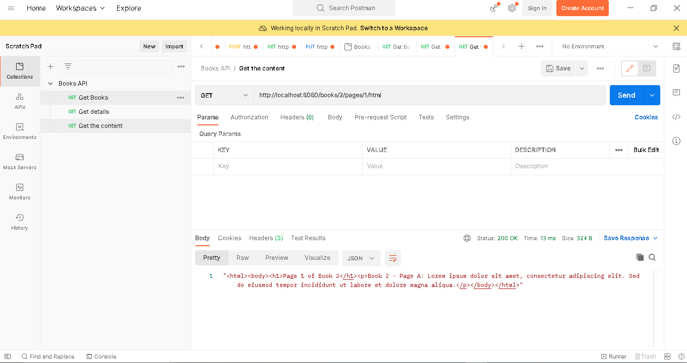
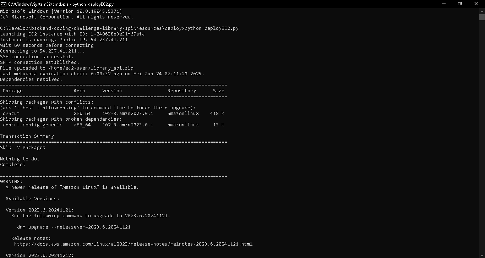

# Library API

The project is built without using frameworks and uses Python's standard http.server module for the REST API.

## Authors 
- Leandro Sepulveda
  - https://leandrosepulveda.com

## Setup and Configuration

### Local Setup

1. **Clone the repository:**
   ```bash
   git clone https://github.com/leosep/library-api.git
   cd library-api
    ```

2. **Create and activate a virtual environment :**
   ```bash
   python3 -m venv venv
   source venv/bin/activate  # On Windows, use venv\Scripts\activate
    ```

3. **Install the required dependencies:**
   ```bash
   pip install -r requirements.txt
    ```

4. **Run the application:**
   ```bash
   python main.py
    ```

5. **Testing the application:**
   ```bash
   python -m unittest discover tests
   ```

### EC2 Deployment with boto3

1. **Install dependencies:**
   ```bash
   pip install boto3
   pip install paramiko
   ```

2. **Set up your AWS credentials:**
   ```bash
   aws configure
   ```

3. **Run the deployment script (resources/deploy):**
   ```bash
   python deployEC2.py
   ```

4. **Verify the deployment**

## Images
### Postman - GET /books


### Postman - GET /books/2


### Postman - GET /books/2/pages/1/html


### Deploying to EC2:
